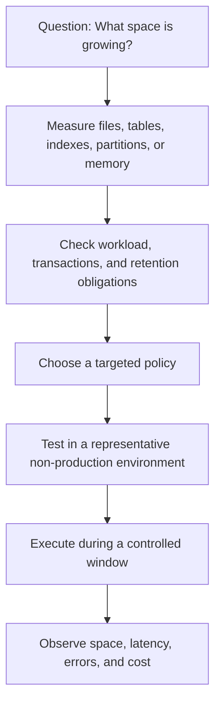

# Assess space and risk

Unused space has several meanings: capacity reserved inside a database file, deleted but not yet physically compacted records, inactive indexes, cache entries, historical data that should be retained elsewhere, or simply headroom needed for normal growth. Measure first, then decide whether reclamation is actually beneficial.

## Assessment checklist

| Area | Questions to answer |
| --- | --- |
| Capacity | Is the issue allocated file size, used pages, transaction log use, cache memory, or service-level quota? |
| Data lifecycle | Is the data obsolete, subject to retention, or better suited for archive storage? |
| Workload | Are long transactions, batch jobs, migrations, or high write volume currently active? |
| Performance | Could a change create blocking, log growth, fragmentation, increased I/O, or cache misses? |
| Recovery | Are backups, restore validation, rollback criteria, and a maintenance window ready? |

## Baseline before any change

- Capture size, used/free capacity, growth rate, query latency, errors, and relevant service metrics.
- Identify large tables, indexes, partitions, containers, key ranges, or cache keys responsible for consumption.
- Check active transactions and long-running work before scheduling relational maintenance.
- Write a measurable success criterion such as target capacity, reduced growth rate, or removal of obsolete data.
- Record the exact service tier, engine version, region, configuration, and time window used for the change.

!!! danger
    Avoid treating `DBCC SHRINKDATABASE`, `DBCC SHRINKFILE`, `REINDEX`, cache eviction, and document deletion as equivalent. Each has a different data movement, durability, performance, and recovery profile. Apply only the service-specific procedure that is supported for the target platform.

## Source diagnostics

The repository's [Azure SQL Managed Instance scripts](https://github.com/Cloud2BR-MSFTLearningHub/azDataBase-Freeing-Unused-Space/tree/main/relational/1_az-sql-mi/src-samples) provide examples for file, database, table, index, filegroup, fragmentation, shrink-operation, and long-running-query investigation. Review and adapt every query to your engine version and operating policy before execution.