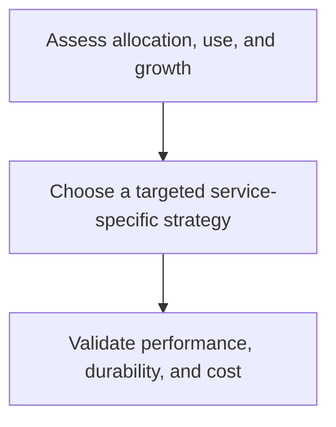

# Azure Database Space Optimization

This learning hub organizes the repository's demos and guides for understanding allocated, used, and reclaimable capacity across Azure database services. The objective is not simply to make a database smaller; it is to choose the right data-lifecycle, storage, index, partition, or cache policy for the workload.

!!! warning
    These guides are learning material. Reclaim operations can be long-running, create blocking or resource pressure, change fragmentation, affect replication or backup behavior, and interact with service-specific limits. Test with representative data, take a recovery-ready approach, and follow the current official guidance for the exact service and tier.

  <a class="guide-card" href="assess-space-and-risk/"><strong>Assess space and risk</strong>Start with measurement, workload context, recovery readiness, and a controlled change plan.</a>
  <a class="guide-card" href="relational-database-strategies/"><strong>Relational database strategies</strong>Explore Azure SQL, SQL Managed Instance, SQL Server on VMs, PostgreSQL, and MySQL patterns.</a>
  <a class="guide-card" href="non-relational-data-strategies/"><strong>Non-relational data strategies</strong>Review Cosmos DB, Cassandra, and cache retention and memory-management considerations.</a>

## Start here

| Need | Start with |
| --- | --- |
| Determine whether a space issue needs action | [Assess space and risk](assess-space-and-risk.md) |
| Plan a relational database change | [Relational database strategies](relational-database-strategies.md) |
| Manage retention or memory in non-relational services | [Non-relational data strategies](non-relational-data-strategies.md) |

## Source material

- [Repository overview](https://github.com/Cloud2BR-MSFTLearningHub/azDataBase-Freeing-Unused-Space/blob/main/README.md)
- [Relational database guides](https://github.com/Cloud2BR-MSFTLearningHub/azDataBase-Freeing-Unused-Space/tree/main/relational)
- [Non-relational database guides](https://github.com/Cloud2BR-MSFTLearningHub/azDataBase-Freeing-Unused-Space/tree/main/non-relational)
- [Azure SQL Managed Instance sample scripts](https://github.com/Cloud2BR-MSFTLearningHub/azDataBase-Freeing-Unused-Space/tree/main/relational/1_az-sql-mi/src-samples)