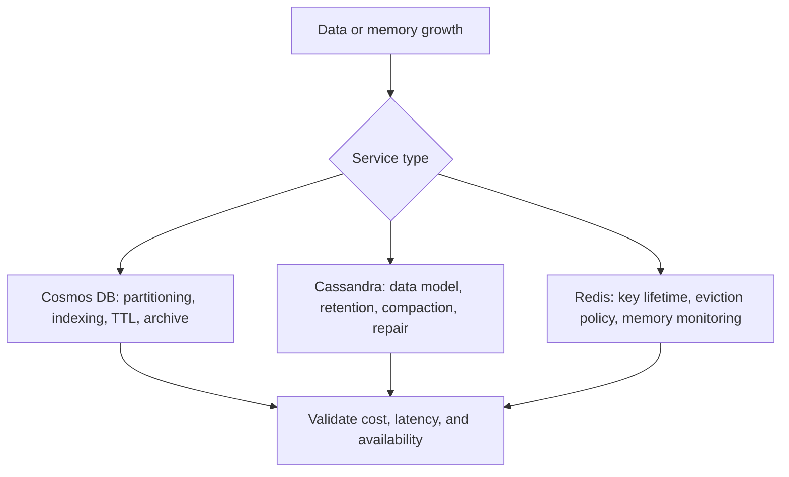

# Non-relational data strategies

In non-relational services, "freeing space" commonly means enforcing retention, distributing load correctly, changing indexing or compaction behavior, or managing cache memory. The right choice depends on the service's storage model and on whether the data is a durable record or disposable acceleration layer.

## Service map

| Service | Focus of a space strategy | Source guide |
| --- | --- | --- |
| Azure Cosmos DB | Partition-key distribution, indexing policy, item retention, archival movement, and request-unit impact. | [Azure Cosmos DB](https://github.com/Cloud2BR-MSFTLearningHub/azDataBase-Freeing-Unused-Space/blob/main/non-relational/0_az-cosmosdb.md) |
| Azure Managed Instance for Apache Cassandra | Data model, partition sizing, TTL and retention, tombstone behavior, compaction, repair, and capacity planning. | [Azure Managed Instance for Apache Cassandra](https://github.com/Cloud2BR-MSFTLearningHub/azDataBase-Freeing-Unused-Space/blob/main/non-relational/1_az-mi-apache-cassandra.md) |
| Azure Cache for Redis | Key expiry, eviction policy, memory pressure, hit rate, eviction rate, and cache-miss effects on backing services. | [Azure Cache for Redis](https://github.com/Cloud2BR-MSFTLearningHub/azDataBase-Freeing-Unused-Space/blob/main/non-relational/2_az-cache-redis.md) |

## Practical guidance

- Use retention policies and TTL only after confirming legal, audit, business, and recovery requirements.
- Design Cosmos DB partition keys for even distribution and validate indexing policy changes against query patterns and RU consumption.
- Treat Cassandra cleanup and compaction as service-specific operational work, not an equivalent of SQL file shrinking.
- For Redis, choose eviction behavior based on whether a key can be safely recomputed or refetched; monitor the backing system for cache-miss load.
- Test deletion, TTL, archival, and index-policy changes with production-like data distribution and access patterns.

!!! tip
    Durable data and cache data deserve different objectives. Archive or retain durable records according to policy; expire or evict cache entries according to freshness, correctness, and dependency capacity.

## Monitor outcomes

Track service-specific capacity, latency, throttling, request cost, eviction or tombstone signals, error rate, and the impact of data movement on dependent applications. A smaller footprint is only a success when reliability and query behavior remain acceptable.