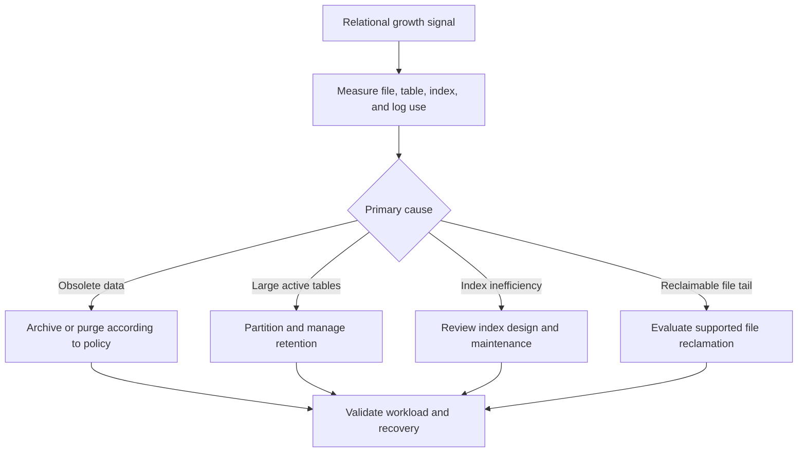

# Relational database strategies

Relational capacity management should start with data retention, schema design, index health, and workload analysis. File-size reclamation can be a specific remediation, but routine shrinking is often a poor substitute for lifecycle management and can introduce follow-on maintenance work.

## Service map

| Service | Common areas to evaluate | Source guide |
| --- | --- | --- |
| Azure SQL Database | Data lifecycle, indexes, compression, partitioning, and service-specific file-space guidance. | [Azure SQL Database](https://github.com/Cloud2BR-MSFTLearningHub/azDataBase-Freeing-Unused-Space/blob/main/relational/0_az-sql-db.md) |
| Azure SQL Managed Instance | File and filegroup usage, active transactions, query behavior, fragmentation, and approved shrink operations. | [Azure SQL Managed Instance](https://github.com/Cloud2BR-MSFTLearningHub/azDataBase-Freeing-Unused-Space/tree/main/relational/1_az-sql-mi) |
| SQL Server on Azure VMs | Database-engine maintenance plus VM storage capacity, IOPS, backup, and operating-system constraints. | [SQL Server on Azure VMs](https://github.com/Cloud2BR-MSFTLearningHub/azDataBase-Freeing-Unused-Space/blob/main/relational/2_sql-az-vm.md) |
| Azure Database for PostgreSQL | Partition lifecycle, indexing, vacuum and maintenance behavior, and archiving according to supported service operations. | [PostgreSQL](https://github.com/Cloud2BR-MSFTLearningHub/azDataBase-Freeing-Unused-Space/blob/main/relational/3_az-postgreSQL.md) |
| Azure Database for MySQL | Data and index design, retention, partitioning where applicable, and service-supported maintenance practices. | [MySQL](https://github.com/Cloud2BR-MSFTLearningHub/azDataBase-Freeing-Unused-Space/blob/main/relational/4_az-db-mysql.md) |

## Guardrails for SQL file reclamation

1. Verify the target file, the required headroom, active transactions, blockers, and recovery options.
2. Prefer a targeted file operation only when the business case requires returning tail space and the current service documentation supports it.
3. Use a controlled maintenance window and monitor waits, log use, throughput, replication, and application errors.
4. Reassess index and file fragmentation after the change; schedule follow-on maintenance only when justified by measurement.
5. Correct the underlying growth driver so the same capacity pressure does not return immediately.

!!! warning
    The repository includes `DBCC SHRINKFILE` and `DBCC SHRINKDATABASE` examples for learning. Do not schedule them as blanket recurring maintenance. Consult [Azure SQL file-space guidance](https://learn.microsoft.com/azure/azure-sql/database/file-space-manage) and your service's current documentation before use.

## Useful source scripts

- [Database size and space usage](https://github.com/Cloud2BR-MSFTLearningHub/azDataBase-Freeing-Unused-Space/blob/main/relational/1_az-sql-mi/src-samples/DatabaseSize_SpaceUsage.sql)
- [Detailed usage by file](https://github.com/Cloud2BR-MSFTLearningHub/azDataBase-Freeing-Unused-Space/blob/main/relational/1_az-sql-mi/src-samples/DetailedSpaceUsage_byFile.sql)
- [Space usage by table](https://github.com/Cloud2BR-MSFTLearningHub/azDataBase-Freeing-Unused-Space/blob/main/relational/1_az-sql-mi/src-samples/SpaceUsage_byTable.sql)
- [Analyze fragmentation](https://github.com/Cloud2BR-MSFTLearningHub/azDataBase-Freeing-Unused-Space/blob/main/relational/1_az-sql-mi/src-samples/Analyze_Fragmentation.sql)